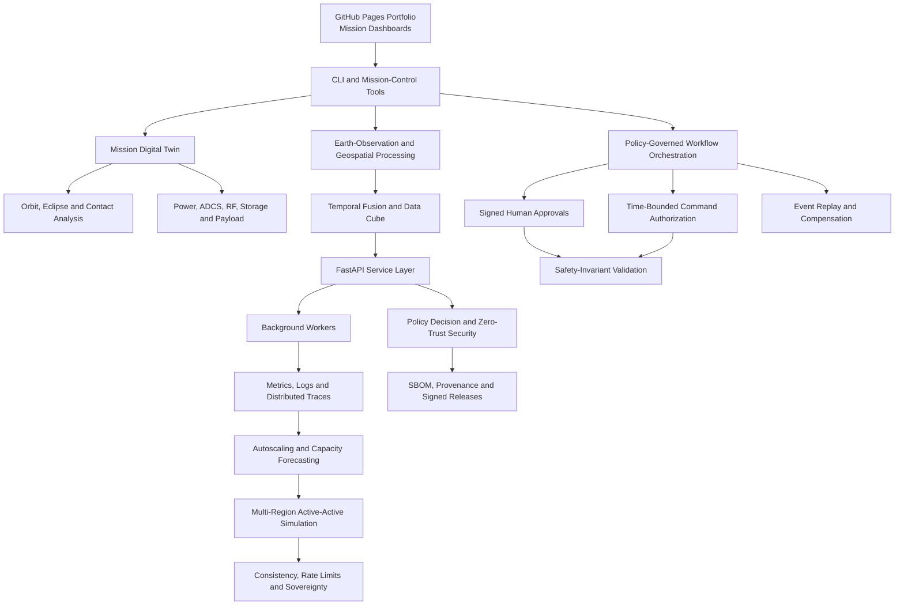

# OpenSat Mission Lab

[](CHANGELOG.md)
[](pyproject.toml)
[](#validation-and-testing)
[](#project-evolution)
[](https://github.com/Samuelson777/OpenSat-Mission-Lab-Versions/blob/main/LICENSE)
[](https://samuelson777.github.io/OpenSat-Mission-Lab-Versions/)

**OpenSat Mission Lab** is an open-source CubeSat mission digital twin and secure mission-operations engineering platform designed to run on a home computer. It combines orbital analysis, spacecraft subsystem simulation, Earth observation, telemetry processing, hardware-in-the-loop experimentation, distributed services, zero-trust security, observability, multi-region resilience, policy governance, workflow orchestration, cryptographic approvals, and safety-invariant validation in one reproducible project.

**Author:** SAMUELSON G  
**Current release:** `v3.1.0`  
**Release history:** `v0.1.0`–`v3.1.0` across 35 documented releases  
**Project type:** Educational, research, portfolio, and pre-operational engineering simulator

> [!IMPORTANT]
> OpenSat Mission Lab does not transmit commands to real spacecraft and is not certified flight software, an accredited ground system, or a substitute for mission-specific safety, security, regulatory, and operational verification.

---

## Table of Contents

- [Project Overview](#project-overview)
- [Live Portfolio Website](#live-portfolio-website)
- [Core Capabilities](#core-capabilities)
- [System Architecture](#system-architecture)
- [Project Evolution](#project-evolution)
- [Quick Start](#quick-start)
- [Command-Line Workflows](#command-line-workflows)
- [GitHub Pages Deployment](#github-pages-deployment)
- [Generated Evidence](#generated-evidence)
- [Validation and Testing](#validation-and-testing)
- [Repository Structure](#repository-structure)
- [Security and Safety Boundaries](#security-and-safety-boundaries)
- [Contributing](#contributing)
- [Conclusion](#conclusion)
- [Future Enhancements](#future-enhancements)
- [Citation](#citation)
- [License](#license)

---

## Project Overview

OpenSat Mission Lab began as a home-PC CubeSat simulation project and evolved into a broad satellite mission engineering and operations environment.

The platform demonstrates how a mission system can be developed incrementally while retaining reproducible evidence for every major engineering layer. The complete release history covers:

- mission definition and configuration;
- orbital, eclipse, contact, and Earth-fixed geometry;
- electrical-power and battery simulation;
- attitude determination and control;
- RF link analysis and adaptive downlink;
- Earth-observation and geospatial processing;
- time-series fusion and data-cube management;
- service APIs, background workers, and tenant isolation;
- governance, security, audit, and disaster recovery;
- zero-trust workload identity and external policy decisions;
- software supply-chain security and signed release evidence;
- service-level objectives, observability, chaos testing, and rollback;
- distributed tracing, autoscaling, and capacity forecasting;
- multi-region active-active operation and data-sovereignty controls;
- replayable workflow orchestration with human approval gates;
- cryptographically signed approvals and safety-invariant checking.

The project is intentionally modular. Individual components can be studied separately, while the complete platform demonstrates how spacecraft, ground, data, software, security, governance, and human-operator concerns interact.

---

## Live Portfolio Website

The repository includes a dependency-free GitHub Pages website in [`docs/`](docs/).

The website provides:

- a searchable explorer for all 35 releases;
- five engineering-era filters;
- an interactive replay of the retained seven-day India flood-monitoring mission;
- 1,600 mission telemetry samples;
- an eight-layer architecture explorer;
- optimized engineering figures;
- retained validation dashboards;
- responsive dark and light themes;
- keyboard-accessible navigation and dialogs.

After publishing the repository, replace the placeholder below with the final Pages URL:

```text
https://YOUR-GITHUB-USERNAME.github.io/YOUR-REPOSITORY-NAME/
```

Local preview:

```bash
python -m http.server 8000 --directory docs
```

Open:

```text
http://127.0.0.1:8000
```

---

## Core Capabilities

### Mission and Spacecraft Engineering

- YAML-based mission configuration
- orbital propagation and ground-track generation
- eclipse and sunlight analysis
- ground-station contact scheduling
- payload observation planning
- attitude-mode and body-rate simulation
- electrical-power generation and consumption modelling
- battery state-of-charge tracking
- onboard storage and data-volume analysis
- RF link-budget estimation
- adaptive data-rate and downlink modelling
- constellation and autonomy demonstrations

### Earth Observation and Geospatial Processing

- raster-based Earth-observation demonstrations
- temporal-observation fusion
- time-series ingestion and analysis
- SQLite-backed geospatial data-cube workflows
- queryable observation metadata
- generated maps, plots, CSV evidence, and dashboards
- flood-monitoring demonstration scenarios

### Hardware and Communications

- hardware-in-the-loop packet replay
- UDP telemetry listener and replay utilities
- packet validation and timing analysis
- serial hardware support through optional dependencies
- software-defined test workflows that remain safe for home-PC use

### Platform Services

- FastAPI service layer
- background worker processing
- tenant-aware repository operations
- service credentials and workload identity
- policy-evaluation endpoints
- audit exports
- disaster-recovery and multi-region recovery simulations
- PostgreSQL row-level-security integration harness

### Security and Governance

- role- and tenant-aware policy controls
- cryptographic audit evidence
- zero-trust workload authentication
- Ed25519-signed identities and approvals
- external OPA-compatible policy decisions
- managed-KMS adapter architecture
- secret scanning
- dependency policy enforcement
- CycloneDX software bill of materials
- signed artifacts and provenance statements
- separation of duties
- command authorization bound to exact command digests
- time-bounded authorization windows

### Reliability and Distributed Operations

- service-level objectives and error budgets
- structured logs, metrics, and trace-shaped evidence
- Prometheus-compatible metrics
- incident and chaos simulations
- automated rollback
- worker recovery and job requeue
- W3C trace-context propagation
- adaptive worker autoscaling
- capacity forecasting
- active-active multi-region simulation
- health-, latency-, load-, cost-, and carbon-aware routing
- cross-region replication and failover
- bounded-staleness and eventual-consistency policy demonstrations
- data-residency and sovereignty routing

### Mission Workflow Orchestration

- dependency-validated workflow DAGs
- human approval and rejection gates
- stable idempotency keys
- duplicate-trigger suppression
- bounded retries
- durable pause and resume
- compensation actions
- hash-chained event history
- deterministic event replay
- workflow-version migration
- cryptographically signed approvals
- exhaustive command-gate safety-model checking

---

## System Architecture



### Engineering Layers

1. **Mission definition** — configuration, scenarios, requirements, and acceptance criteria.
2. **Spacecraft digital twin** — orbit, payload, power, attitude, communications, and storage.
3. **Earth-observation data** — raster processing, temporal fusion, and data-cube queries.
4. **Platform services** — APIs, workers, repositories, credentials, and tenancy.
5. **Security and governance** — policy, audit, zero trust, supply-chain controls, and sovereignty.
6. **Reliability engineering** — observability, SLOs, chaos testing, recovery, and autoscaling.
7. **Distributed operations** — multi-region routing, replication, consistency, and failover.
8. **Mission assurance** — workflow orchestration, signed approvals, authorization, replay, and safety checks.

---

## Project Evolution

| Engineering era | Releases | Main focus |
|---|---:|---|
| Digital-twin foundations | v0.1–v0.9 | Mission configuration, orbit, telemetry, payload, power, communications, dashboards, and verification |
| Advanced mission analysis | v1.0–v1.3 | Autonomy, constellation studies, Earth observation, temporal fusion, data cubes, and hardware testing |
| Platform engineering | v2.0–v2.3 | Service APIs, workers, multi-tenancy, governance, audit, disaster recovery, and security |
| Secure distributed operations | v2.4–v2.9 | Zero trust, supply-chain security, observability, tracing, autoscaling, multi-region resilience, consistency, and sovereignty |
| Safety-governed orchestration | v3.0–v3.1 | Workflow DAGs, human approvals, compensation, signed authorization, migration, replay, and safety invariants |

See [`CHANGELOG.md`](CHANGELOG.md) for the complete release-by-release history.

---

## Quick Start

### Requirements

- Python `3.10` or later
- Git
- VS Code recommended
- A modern web browser
- Windows, Linux, or macOS

Optional capabilities use Docker, PostgreSQL, cloud SDKs, serial hardware, or internet-connected security scanners.

### 1. Clone the repository

```bash
git clone https://github.com/YOUR-GITHUB-USERNAME/YOUR-REPOSITORY-NAME.git
cd YOUR-REPOSITORY-NAME
```

### 2. Open the VS Code workspace

```text
OpenSat-Mission-Lab.code-workspace
```

### 3. Run the setup script

Windows PowerShell:

```powershell
Set-ExecutionPolicy -Scope Process Bypass
.\scripts\setup_windows.ps1
```

Linux or macOS:

```bash
chmod +x scripts/setup_unix.sh
./scripts/setup_unix.sh
```

### 4. Select the interpreter

Windows:

```text
.venv\Scripts\python.exe
```

Linux or macOS:

```text
.venv/bin/python
```

### Manual installation

```bash
python -m venv .venv
```

Activate the environment:

```bash
# Linux or macOS
source .venv/bin/activate
```

```powershell
# Windows PowerShell
.venv\Scripts\Activate.ps1
```

Install the complete development and service environment:

```bash
python -m pip install --upgrade pip
python -m pip install -e ".[dev,services,cloud]"
```

Available optional groups:

```bash
python -m pip install -e ".[services]"
python -m pip install -e ".[postgres]"
python -m pip install -e ".[hardware]"
python -m pip install -e ".[cloud]"
```

---

## Command-Line Workflows

### Current v3.1 safety-assurance demonstration

```bash
opensat-v31-demo --output outputs/v3.1
```

Equivalent main command:

```bash
opensatlab v31-demo --output outputs/v3.1
```

### Core mission simulation

```bash
python -m opensatlab.cli run \
  configs/india_flood_monitoring.yaml \
  --output outputs/demo
```

### Mission acceptance workflow

```bash
python -m opensatlab.cli accept \
  configs/india_flood_monitoring.yaml \
  --output outputs/acceptance
```

### Earth-observation demonstration

```bash
python -m opensatlab.cli earth-observation-demo \
  --scene examples/earth_observation/demo_scene.tif \
  --output outputs/earth-observation
```

### Temporal fusion and time-series workflows

```bash
python -m opensatlab.cli temporal-demo \
  --dataset examples/temporal_observation \
  --output outputs/temporal-fusion
```

```bash
python -m opensatlab.cli timeseries-demo \
  --dataset examples/timeseries_observation \
  --output outputs/timeseries
```

### Data-cube workflow

```bash
python -m opensatlab.cli datacube-demo \
  --workspace examples/timeseries_observation \
  --output outputs/datacube
```

```bash
python -m opensatlab.cli datacube-query \
  --database outputs/datacube/opensat_datacube.sqlite \
  --after 2026-07-09
```

### Platform and security demonstrations

```bash
opensat-governance-demo \
  --workspace examples/timeseries_observation \
  --output outputs/services
```

```bash
opensat-security-demo \
  --workspace examples/timeseries_observation \
  --output outputs/services
```

```bash
opensat-zero-trust-demo \
  --workspace examples/timeseries_observation \
  --output outputs/services
```

```bash
opensat-supply-chain-demo \
  --project-root . \
  --output outputs/supply-chain
```

### Reliability and distributed-operations demonstrations

```bash
opensat-observability-demo --output outputs/observability
opensat-v27-demo --output outputs/v2.7
opensat-v28-demo --output outputs/v2.8
opensat-v29-demo --output outputs/v2.9
opensat-v30-demo --output outputs/v3.0
opensat-v31-demo --output outputs/v3.1
```

### API and worker

Start the API:

```bash
opensat-api \
  --database outputs/services/datacube/opensat_datacube.sqlite \
  --output-root outputs/services \
  --host 127.0.0.1 \
  --port 8080
```

Run one worker cycle:

```bash
opensat-worker \
  --database outputs/services/datacube/opensat_datacube.sqlite \
  --once
```

API documentation:

```text
http://127.0.0.1:8080/docs
```

### Hardware-in-the-loop replay

Terminal 1:

```bash
python -m opensatlab.cli hil-listen \
  --host 127.0.0.1 \
  --port 5010 \
  --expected-packets 20
```

Terminal 2:

```bash
python -m opensatlab.cli hil-replay \
  outputs/demo/telemetry_packets.csv \
  --host 127.0.0.1 \
  --port 5010 \
  --rate-hz 20 \
  --max-packets 20
```

---

## GitHub Pages Deployment

The complete static portfolio is stored in [`docs/`](docs/).

### GitHub Actions deployment

The repository includes:

```text
.github/workflows/pages-portfolio.yml
```

To publish:

1. Push the repository to GitHub.
2. Open **Settings → Pages**.
3. Select **GitHub Actions** as the deployment source.
4. Run the Pages workflow or push a change affecting `docs/`.

### Branch deployment

GitHub Pages can also serve directly from:

```text
Default branch → /docs
```

### Validate the website locally

```bash
python docs/validate_site.py
```

The validator checks:

- local HTML asset references;
- JavaScript syntax when Node.js is available;
- all 35 release records;
- mission telemetry parsing;
- evidence images;
- retained dashboards.

---

## Generated Evidence

Each major workflow writes reproducible evidence to `outputs/`.

Examples include:

```text
outputs/
├── demo/
│   ├── mission_control_dashboard.html
│   ├── telemetry_packets.csv
│   ├── battery_state_of_charge.png
│   ├── ground_track.png
│   └── mission_summary.*
├── services/
│   ├── security_validation_dashboard.html
│   ├── zero_trust_validation_dashboard.html
│   └── OpenAPI and recovery evidence
├── supply-chain/
│   ├── cyclonedx_sbom.json
│   ├── provenance.intoto.json
│   └── supply_chain_validation_dashboard.html
├── observability/
│   ├── observability_dashboard.html
│   ├── service_metrics.csv
│   ├── alerts.csv
│   └── traces.jsonl
├── v2.7/
│   ├── distributed traces
│   ├── autoscaling decisions
│   └── capacity forecasts
├── v2.8/
│   ├── regional health
│   ├── traffic steering
│   └── replication evidence
├── v2.9/
│   ├── consistency decisions
│   ├── sovereignty routing
│   └── audit-chain evidence
├── v3.0/
│   ├── workflow events
│   ├── approvals
│   ├── compensation actions
│   └── replay validation
└── v3.1/
    ├── signed approvals
    ├── command grants
    ├── safety-state evaluation
    ├── workflow migration
    └── v31_safety_assurance_dashboard.html
```

Generated evidence is designed for technical review, portfolio demonstrations, regression testing, and reproducible experimentation.

---

## Validation and Testing

Run the full test suite:

```bash
python -m pytest -q
```

Run the website validator:

```bash
python docs/validate_site.py
```

Compile the Python source:

```bash
python -m compileall -q src tests
```

Current verified project evidence includes:

| Validation area | Result |
|---|---:|
| Documented releases | 35 |
| Release range | v0.1.0–v3.1.0 |
| Application tests | 203 passed |
| GitHub Pages mission samples | 1,600 |
| Retained website dashboards | 18 |
| Safety-assurance controls | 28 of 28 passed |
| Signed approval records verified | 10 |
| Unsafe command attempts blocked | 5 |
| Workflow snapshots migrated | 3 |
| Command-gate states checked | 256 |
| Safety-invariant violations | 0 |

The 203 application tests were validated in isolated partitions in the integrated website release because a single long-running process encountered cumulative resource pressure late in the suite. All test groups passed.

---

## Repository Structure

```text
opensat-mission-lab/
├── .github/
│   └── workflows/                  # CI, security and Pages workflows
├── .vscode/                        # Launch profiles and development tasks
├── configs/                        # Mission, service and policy configurations
├── deploy/                         # PostgreSQL and deployment assets
├── docs/                           # GitHub Pages website
├── examples/                       # Demonstration scenes and observation data
├── outputs/                        # Generated engineering evidence
├── runbooks/                       # Operator and recovery procedures
├── scripts/                        # Setup and validation scripts
├── src/
│   └── opensatlab/
│       ├── mission_control/
│       ├── services/
│       └── simulation and analysis modules
├── tests/                          # Automated validation
├── CHANGELOG.md
├── CITATION.cff
├── CODE_OF_CONDUCT.md
├── CONTRIBUTING.md
├── LICENSE
├── OpenSat-Mission-Lab.code-workspace
├── pyproject.toml
├── README.md
└── SECURITY.md
```

---

## Security and Safety Boundaries

OpenSat Mission Lab includes security and safety engineering demonstrations, but several boundaries must remain explicit:

- deterministic signing keys are demonstration identities;
- simulated command authorization does not grant real operational authority;
- no real spacecraft commands are transmitted;
- policy and regional scenarios are educational inputs;
- simulated RTO, RPO, cost, latency, and carbon results are not cloud-provider guarantees;
- offline vulnerability fixtures are not a replacement for current advisory feeds;
- the PostgreSQL RLS harness requires a live disposable PostgreSQL environment for database-enforced validation;
- the safety-state model verifies the defined educational state space, not complete flight software;
- operational deployment would require independent verification and validation, secure key custody, legal review, mission-specific threat modelling, hazard analysis, and certification.

Security issues should be reported according to [`SECURITY.md`](SECURITY.md), not through a public issue containing sensitive details.

---

## Contributing

Contributions are welcome in areas such as:

- orbital and spacecraft modelling;
- geospatial algorithms;
- telemetry processing;
- mission visualisation;
- distributed-systems engineering;
- cybersecurity and supply-chain controls;
- accessibility and documentation;
- testing and reproducibility;
- hardware-in-the-loop adapters;
- educational laboratories.

Before contributing:

1. Read [`CONTRIBUTING.md`](CONTRIBUTING.md).
2. Follow [`CODE_OF_CONDUCT.md`](CODE_OF_CONDUCT.md).
3. Create a focused branch.
4. Add or update tests.
5. Run the relevant validation workflows.
6. Submit a pull request describing the engineering rationale and generated evidence.

---

## Conclusion

OpenSat Mission Lab demonstrates how a home-computer-based open-source project can evolve into a comprehensive satellite mission engineering, operations, security, and governance platform.

From v0.1.0 through v3.1.0, the project progressively connects mission planning, orbital analysis, spacecraft subsystem simulation, Earth observation, geospatial processing, distributed services, zero-trust security, supply-chain protection, observability, multi-region resilience, policy governance, human approval, workflow replay, cryptographic authorization, and safety-invariant validation.

The project’s main strength is its evidence-driven development approach. Important capabilities are accompanied by automated tests, dashboards, plots, structured logs, traces, audit records, signed artifacts, policy evaluations, recovery exercises, and reproducible outputs. The retained release history shows engineering progression rather than presenting only a final software snapshot.

The GitHub Pages website makes the complete development history accessible as a technical portfolio. Visitors can explore all 35 releases, replay mission telemetry, inspect engineering layers, and review generated evidence without installing the Python application.

The project achieves its primary objective: demonstrating a broad combination of space engineering, software development, data science, security, DevOps, distributed systems, mission operations, and technical documentation skills using tools that can run on a personal computer.

OpenSat Mission Lab remains an educational and engineering simulator. Operational use would require independent verification, mission-specific infrastructure, formal safety engineering, regulatory assessment, secure key management, and appropriate certification.

---

## Future Enhancements

### 1. Live public space-data integration

Connect maintained orbital catalogues, public Earth-observation products, weather information, geomagnetic data, and community ground-station observations while retaining deterministic offline fixtures.

### 2. Higher-fidelity astrodynamics

Add numerical propagation with atmospheric drag, Earth oblateness, solar-radiation pressure, manoeuvre design, conjunction analysis, uncertainty propagation, and covariance handling.

### 3. Expanded spacecraft digital twin

Model thermal behaviour, reaction-wheel momentum, magnetic torquers, battery ageing, radiation effects, sensor noise, component degradation, and subsystem fault propagation.

### 4. Hardware-in-the-loop laboratory

Integrate single-board computers, microcontrollers, radios, sensors, hardware security modules, and simulated flight computers through safe, test-only interfaces.

### 5. Ground-station and CCSDS support

Add pass scheduling, antenna pointing, Doppler correction, packet framing, contact-plan optimisation, and standards-aligned telemetry structures without enabling uncontrolled transmission.

### 6. Production-grade durable orchestration

Add adapters for durable workflow systems, persistent task queues, distributed locks, workflow migration, long-running approvals, and independently validated compensation behaviour.

### 7. Stronger formal methods

Express critical properties with temporal logic, state-machine specifications, property-based testing, model checking, and machine-readable assurance cases.

### 8. Operational key management

Replace demonstration keys with hardware-backed or managed-key integrations, trusted timestamps, certificate rotation, revocation, threshold signing, and geographically separated approval identities.

### 9. Defensive cyber range

Create controlled attack-and-recovery scenarios covering replay, credential theft, malicious dependencies, compromised workers, policy outages, data poisoning, insider threats, and regional infrastructure compromise.

### 10. Real multi-region infrastructure

Validate routing, consistency, recovery, sovereignty, and cost models against disposable cloud or local-cluster deployments using real databases, queues, object stores, and observability systems.

### 11. Explainable mission intelligence

Add anomaly detection, energy forecasting, cloud prediction, pass-quality estimation, downlink optimisation, and target prioritisation with confidence, provenance, explainability, monitoring, and human override.

### 12. Advanced geospatial analytics

Add image registration, atmospheric correction, cloud masking, spectral indices, change detection, segmentation, flood-depth estimation, wildfire monitoring, and uncertainty visualisation.

### 13. Plug-in framework

Provide stable extension interfaces for orbit models, sensors, processors, policies, visualisations, storage systems, and data connectors.

### 14. Collaborative mission operations

Introduce role-specific operator workspaces, shared timelines, decision records, approval queues, incident rooms, and real-time status updates while preserving separation of duties.

### 15. Expanded education content

Create guided laboratories for orbital mechanics, spacecraft power, telemetry, geospatial analysis, APIs, zero trust, software supply chains, observability, distributed systems, and mission safety.

### 16. Independent benchmarking

Compare the project against reference datasets, public mission records, recognised algorithms, independently defined scenarios, and reproducible performance and accuracy benchmarks.

### 17. Operational-readiness roadmap

Develop requirements traceability, hazard analysis, threat modelling, configuration management, fault injection, reliability studies, independent verification and validation, operator training, and certification planning.

The priority for future development should be deeper realism, stronger verification, better interoperability, and reproducible evidence—not feature quantity alone.

---

## Citation

Citation metadata is available in [`CITATION.cff`](CITATION.cff).

Suggested citation:

```text
Samuelson G. OpenSat Mission Lab: An Open-Source CubeSat Digital Twin,
Secure Mission Platform, and Safety-Governed Operations Laboratory.
Version 3.1.0.
```

---

## License

This project is released under the [MIT License](https://github.com/Samuelson777/OpenSat-Mission-Lab-Versions/blob/main/LICENSE).

---

## Author

**SAMUELSON G**

Open-source satellite mission engineering, Earth observation, platform security, distributed operations, and safety-assurance project.
